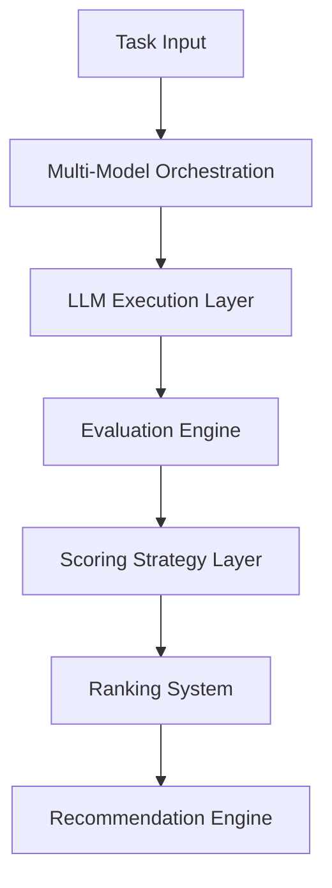

# LLM Evaluation Platform

A system for evaluating, comparing, and ranking LLM outputs under real-world constraints (quality, cost, latency).

It provides a reproducible pipeline for multi-model evaluation, configurable scoring strategies, and recommendation-based model selection.

---

## ⚡ 10-Second Summary

A production-style evaluation system that:

- runs multiple LLMs on identical inputs
- evaluates outputs using structured metrics
- applies trade-off-aware scoring strategies
- ranks models and generates recommendations
- supports reproducible experimentation

---

## 🧠 Why this exists

LLM outputs are:
- non-deterministic
- difficult to compare objectively
- sensitive to cost/latency trade-offs

This system formalises evaluation into a **repeatable decision pipeline**.

---

## 🏗️ System Overview

## 🧩 Core Design
1. Orchestration Layer

Executes multiple models against a shared input.

2. Evaluation Layer

Computes structured metrics:

- BLEU / ROUGE
- BERTScore
- hallucination / faithfulness signals
  
3. Scoring Layer

Applies configurable trade-offs:

- balanced
- quality-first
- cost-aware
- latency-aware

4. Decision Layer

Produces:

- ranked model outputs
- confidence-weighted recommendations
- use-case-specific selection

## ⚖️ Engineering Trade-offs
**Determinism vs Flexibility**

 Metrics are structured but evaluation remains probabilistic.

**Accuracy vs Cost**

Higher evaluation fidelity increases compute cost.

**Interpretability vs Optimality**

Rule-based scoring ensures transparency over black-box ranking.

## 📊 What this demonstrates
- multi-model orchestration systems
- evaluation pipeline design
- scoring + ranking architecture
- production API design
- experiment reproducibility
  
## 🚀 Key Capabilities
- Multi-model execution pipeline
- Configurable evaluation metrics
- Strategy-based scoring engine
- Recommendation system with confidence signals
- Experiment logging and replayability
- Docker + CI/CD support
## 📌 Deep Dive
[Case Study](docs/case-study.md)
[Architecture](docs/architecture.md)
Evaluation System: docs/evaluation.md
