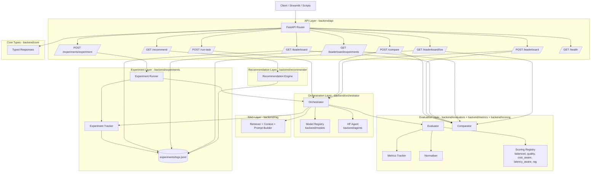

# AI Orchestration Utility

[](https://www.python.org/)
[](LICENSE)

A modular **LLM evaluation and orchestration platform** with metrics tracking, Docker, and CI/CD integration.  
Designed for **production-ready experimentation with LLMs**, evaluation of outputs, and orchestration of complex AI tasks.

---

## **🚀 Features**

- **Multi-Model Orchestration**  
  Run tasks across multiple model profiles with unified retrieval, prompting, evaluation, and comparison.

- **Metrics Tracking**  
  Evaluate AI outputs using:
  - BERTScore (or token-overlap fallback)  
  - BLEU  
  - ROUGE (ROUGE-1, ROUGE-L)  
  - Perplexity proxy  
  - Hallucination rate  
  - Faithfulness to retrieved context  
  - Diversity score  
  - Multi-reference best-match scoring  

- **Dockerized Environment**  
  Fully reproducible builds, including NLTK resources.

- **CI/CD Ready**  
  - Unit tests run automatically on GitHub Actions  
  - Integration tests run locally (excluded from CI/CD for speed)  

- **Extensible**  
  Add new agents, metrics, or connectors with minimal effort.

---

## **📂 Repository Structure**

```text
ai-orchestration-utility/
├─ backend/
│  ├─ agents/
│  ├─ api/
│  ├─ core/
│  ├─ evaluators/
│  ├─ experiments/
│  ├─ metrics/
│  ├─ models/
│  ├─ orchestrator/
│  ├─ rag/
│  ├─ scoring/
│  └─ tests/
│     ├─ unit/
│     └─ integration/
├─ frontend/
├─ utils/
│  └─ setup_nltk.py
├─ requirements.txt
├─ Dockerfile
└─ README.md
```

- `backend/tests/unit/` → Unit tests used in CI/CD.
- `backend/tests/integration/` → Integration tests for local validation.
- `utils/setup_nltk.py` → Ensures NLTK data (e.g., `punkt`) is available locally or in Docker.

---

## **🏗️ Architecture**

### **Core Layers**

- **API Layer** (`backend/api/`): FastAPI routes for task execution, comparison, and leaderboard access.
- **Orchestration Layer** (`backend/orchestrator/`): Coordinates model selection, retrieval, generation, and evaluation.
- **Evaluation Layer** (`backend/evaluators/`, `backend/scoring/`, `backend/metrics/`): Computes metrics and strategy-specific scores.
- **RAG Layer** (`backend/rag/`): Retrieval interface and context construction for grounded generation.
- **Experiment Layer** (`backend/experiments/`): Batch workflows and run logging (`experiments/logs.jsonl`) for historical analysis.

### **Architecture Diagram**



### **Request Flow**

1. Client calls an endpoint (`/run-task`, `/compare`, `POST /leaderboard`, `GET /recommend`, or `POST /experiments/experiment`).
2. API invokes `Orchestrator.process_task(...)` per requested model.
3. Orchestrator performs retrieval, prompt building, generation, and evaluation.
4. Metrics are normalized and scored via registered scoring strategies; recommendation requests are aggregated by the recommendation engine from logs.
5. API returns typed response payloads (run details, evaluation contracts, rankings, and narratives).

### **Leaderboard Modes**

- **Prompt mode** (`POST /leaderboard`): ranks models from on-demand runs.
- **Historical mode** (`GET /leaderboard`): ranks by latest logged run per model (Option A).
- **Pagination**: `page` + `page_size` with `has_more` and `next_page` for load-more UX.

---

## **⚡ Quick Start**

### **1️⃣ Clone the repo**

```bash
git clone https://github.com/NadiaR96/ai-orchestration-utility.git
cd ai-orchestration-utility
```

### **2️⃣ Install Python dependencies**

```bash
pip install -r requirements.txt
```

Note: this platform includes heavier ML dependencies (for example `torch`, `transformers`, and `faiss-cpu`), so plan for higher memory and image size in cloud deployments.

### **3️⃣ Setup NLTK data**

```bash
python utils/setup_nltk.py
```

### **4️⃣ Run unit tests**

```bash
python -m unittest discover -s backend/tests/unit -p "test_*.py"
```

### **5️⃣ Optional: Run full test suite**

```bash
python -m unittest discover -s backend/tests -p "test_*.py"
```

### **6️⃣ Optional: Run unit tests in Docker**

```bash
docker build -t ai-orchestration-utility:latest .
docker run --rm ai-orchestration-utility:latest
```

The default container command runs unit tests (`backend/tests/unit`).

### **7️⃣ API request examples**

Use the examples in [`examples/`](examples/) for ready-made requests:

- [`examples/requests.http`](examples/requests.http) for direct endpoint calls.
- [`examples/payloads/run-task.json`](examples/payloads/run-task.json)
- [`examples/payloads/compare.json`](examples/payloads/compare.json)
- [`examples/payloads/leaderboard-prompt.json`](examples/payloads/leaderboard-prompt.json)

### **8️⃣ Streamlit UI (optional)**

Run the backend first:

```bash
uvicorn backend.main:app --reload --host localhost --port 8000
```

In another terminal, start Streamlit:

```bash
streamlit run frontend/streamlit_app.py
```

The UI includes:
- Interactive tables for compare, recommendation, and live degradation views.
- Winner highlighting in compare and recommendation scenarios.
- Explicit trade-off summaries (quality vs latency vs cost).
- Explicit degradation indicators from live trend direction and delta.

## **🧭 API Endpoints**

| Method | Path | Purpose | Example |
|---|---|---|---|
| `GET` | `/health` | Service health check | [`examples/requests.http`](examples/requests.http) |
| `POST` | `/run-task` | Execute one model run and return run + evaluation | [`examples/payloads/run-task.json`](examples/payloads/run-task.json) |
| `POST` | `/compare` | Run multiple models and return side-by-side comparison | [`examples/payloads/compare.json`](examples/payloads/compare.json) |
| `POST` | `/leaderboard` | Prompt-based leaderboard across all scoring systems | [`examples/payloads/leaderboard-prompt.json`](examples/payloads/leaderboard-prompt.json) |
| `POST` | `/experiments/experiment` | Execute a batch experiment and log results | [`examples/requests.http`](examples/requests.http) |
| `GET` | `/leaderboard` | Backward-compatible historical leaderboard alias | [`examples/requests.http`](examples/requests.http) |
| `GET` | `/leaderboard/experiments` | Experiment-backed leaderboard (latest run per model) | [`examples/requests.http`](examples/requests.http) |
| `GET` | `/leaderboard/live` | Live monitoring leaderboard (window + min samples + ranking basis) | [`examples/requests.http`](examples/requests.http) |
| `GET` | `/recommend` | Recommend best model for a use-case and scoring strategy | [`examples/requests.http`](examples/requests.http) |

## **📊 Leaderboard API**

The project now supports model leaderboards across all scoring systems (`balanced`, `quality`, `cost_aware`, `latency_aware`, `rag`).

### **Prompt-Based Leaderboard**

`POST /leaderboard`

Request body example:

```json
{
  "input": "Explain retrieval augmented generation",
  "reference": "RAG combines retrieval with generation.",
  "models": ["small", "default", "quality"],
  "retrieval": "rag",
  "sort_strategy": "balanced",
  "aggregation": "latest",
  "page": 1,
  "page_size": 10
}
```

### **Historical Leaderboard (Latest Per Model)**

`GET /leaderboard?page=1&page_size=10&sort_strategy=balanced&aggregation=latest`

Optional model filter:

`GET /leaderboard?page=1&page_size=10&sort_strategy=balanced&aggregation=latest&models=small,quality`

Historical mode uses the latest logged run per model (Option A) and supports load-more via `page`, `page_size`, `has_more`, and `next_page`.
`aggregation=latest` is currently the only supported aggregation mode (mean aggregation is planned for a future version).

### **Dedicated Experiment Leaderboard**

`GET /leaderboard/experiments?page=1&page_size=10&sort_strategy=balanced&aggregation=latest`

This endpoint is intended for reproducible benchmark-style rankings sourced from experiment logs.

### **Live Degradation Leaderboard**

`GET /leaderboard/live?page=1&page_size=10&sort_strategy=balanced&window_hours=24&min_samples=1&ranking_basis=window_avg`

This endpoint is intended for operational monitoring using recent live calls.

**Query parameters:**
- `window_hours` (default `24`, max `168`): time window to load and average runs from
- `min_samples` (default `1`): minimum runs a model must have within the window to appear
- `ranking_basis` (`window_avg` | `latest`, default `window_avg`): controls how models are ranked
  - `window_avg` — ranks by average score across all runs in the current window (recommended)
  - `latest` — ranks by the most recent run's snapshot score (previous behaviour)

Each leaderboard item includes:
- `latest_score`: the score of the model's most recent run in the window
- `sample_count`: total runs included for this model in the window
- `trend`: metadata comparing the current window to the previous window
  - `direction`: `up`, `down`, `stable`, `new`, or `insufficient_history`
  - `delta_score`: change in average score between windows
  - `current_avg_score`, `previous_avg_score`
  - `current_samples`, `previous_samples`

## **🤖 Recommendation API**

`GET /recommend?use_case=summarisation&strategy=balanced&top_n=3&min_samples=1&source=all`

Returns the best model for a given task type and scoring strategy, derived from the experiment and/or live logs.

**Query parameters:**
- `use_case` *(required)*: Task description (e.g. `summarisation`, `code generation`). If log entries carry a matching `use_case` tag, only those are used; otherwise all entries are used as a fallback.
- `strategy` (default `balanced`): Scoring strategy to rank by (`balanced`, `quality`, `cost_aware`, `latency_aware`, `rag`)
- `top_n` (default `3`, max `20`): Number of ranked alternatives to include in the response
- `min_samples` (default `1`): Minimum logged runs a model must have to qualify
- `source` (default `all`): Log scope — `live`, `experiment`, or `all`

**Response fields:**
- `best_model`: Name of the recommended model
- `best_score`: Average strategy score for the best model
- `validity_status`, `is_valid`, `validity_reasons`: Validity gating result for recommendation quality control
- `confidence_reasons`: Human-readable guard-rail explanations for the top choice
- `alternatives`: Ranked list of up to `top_n` models — each with `score`, `sample_count`, `avg_latency`, `avg_cost`, `score_stddev`, `score_delta_from_best`, `confidence`, `p95_latency`, `consistency_above_threshold`
- `justification`: Human-readable explanation of why this model was chosen

### Canonical Evaluation Contract

The recommendation response includes a canonical nested `evaluation` object for semantic decision state and reliability:

- `evaluation.system_health`: `OK | DEGRADED | FAIL`
- `evaluation.evaluation_status`: `VALID | WEAK_SIGNAL | INSUFFICIENT_DATA | NOISY | UNSTABLE | INVALID`
- `evaluation.decision.state`: `RECOMMENDED | CONSTRAINED | ABSTAIN | INVALID`
- `evaluation.reliability.label`: `LOW | MEDIUM | HIGH | INSUFFICIENT EVIDENCE`
- `evaluation.failure_analysis.modes`: canonical failure modes (`LOW_QUALITY`, `LOW_SEPARATION`, `INSUFFICIENT_DATA`, `HIGH_VARIANCE`, `COST_DOMINATED`, `LATENCY_DOMINATED`, `ALL_MODELS_WEAK`, `LOW_CONSISTENCY`, `USE_CASE_MISMATCH`, `SCORE_SCALE_DRIFT`)

The nested `evaluation` block is the canonical semantic source of truth.

**Recommendation audit log:** Every call is appended to `recommendations/recommendations.jsonl`.

## **🛠️ CI/CD Workflow**

Runs on push or pull request to main branch.

Steps:
- Checkout code
- Setup Python
- Install dependencies
- Setup NLTK resources
- Run unit tests
- Build Docker image
- Run Docker container for verification

Integration tests run on `workflow_dispatch` only (they load real HuggingFace models and require secrets).

## **📈 Extending the Platform**

- Add new agents: place implementations in `backend/agents/` and route them in `backend/orchestrator/orchestrator.py`.
- Add new metrics: implement metric logic in `backend/metrics/metrics_tracker.py`.
- Add new scoring strategies: add scorer classes in `backend/scoring/` and register them in `backend/scoring/registry.py`.
- Extend experiment workflows: use `backend/experiments/` and expose routes through `backend/api/`.

## **🎯 Why This Project Matters**

- Demonstrates multi-model orchestration and RAG architecture.
- Provides a practical evaluation stack for quality, hallucination, and efficiency metrics.
- Shows production fundamentals: test coverage, API boundaries, and containerized execution.

## **📝 Design Notes**
- The platform is designed for **production-readiness and extensibility** rather than minimalism. It includes a comprehensive evaluation suite and orchestration capabilities to support real-world experimentation and monitoring.
- The architecture emphasizes **modularity** with clear separation of concerns across API, orchestration, evaluation, and experiment layers, enabling easy extension and maintenance.
- The recommendation system is built on a **canonical evaluation contract** to ensure consistent decision logic and reliability assessment, which is crucial for operational use cases.
- The leaderboard supports both **prompt-based and historical rankings**, with pagination for scalability and a dedicated endpoint for experiment-sourced rankings, reflecting the need for both on-demand evaluation and reproducible benchmarks.

## **️⃣ Future Improvements**
- Add mean aggregation to leaderboard endpoints.
- Implement additional evaluation metrics (e.g., factuality, bias).
- Enhance the recommendation engine with more sophisticated validity gating and confidence estimation.
- Add support for more model providers and custom model definitions.

## **️⃣ Current Limitations**
- The current implementation uses a simple JSONL file for experiment logging, which may not scale well for large volumes of runs or concurrent access. Future versions could integrate a more robust database solution.
- The recommendation engine relies on heuristic-based validity gating and confidence estimation, which may not capture all nuances of model performance. Future iterations could explore more advanced techniques, such as meta-models or causal inference, for improved recommendation quality.
- The platform currently focuses on text-based tasks and may require adjustments to support other modalities (e.g., vision, audio) or multi-modal tasks.

## **📄 License**

MIT License. See LICENSE
 for details.

---

## **🔐 Environment Variables**

The backend automatically loads a .env file from the repository root when the backend package is imported.

For Hugging Face access, the preferred key is HF_TOKEN.

Supported token keys:
- HF_TOKEN
- HUGGINGFACEHUB_API_TOKEN
- HUGGINGFACE_HUB_TOKEN

If HF_TOKEN is missing but one of the alias keys is present, the backend maps it to HF_TOKEN automatically.