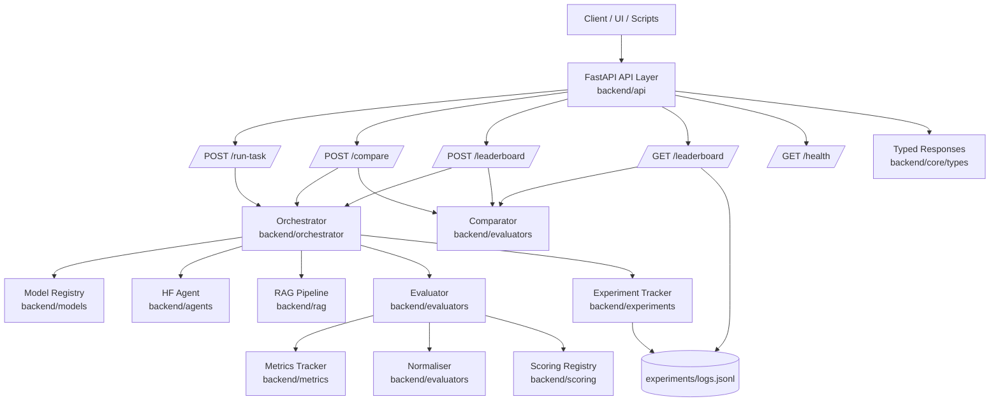

# AI Orchestration Utility

[](https://www.python.org/)
[](LICENSE)

A lightweight **multi-agent AI orchestration platform** with metrics tracking, Docker, and CI/CD integration.  
Designed for **production-ready experimentation with LLMs**, evaluation of outputs, and orchestration of complex AI tasks.

---

## **🚀 Features**

- **Multi-Agent Orchestration**  
  Run multiple instances of AI agents concurrently with flexible task assignment.

- **Metrics Tracking**  
  Evaluate AI outputs using:
  - BLEU  
  - METEOR  
  - ROUGE  
  - Cosine Similarity  
  - Diversity Score  
  - Coverage Score  
  - Hallucination Rate  
  - F1, Precision, Recall  

- **Dockerized Environment**  
  Fully reproducible builds, including NLTK resources.

- **CI/CD Ready**  
  - Unit tests run automatically on GitHub Actions  
  - Integration tests run locally (excluded from CI/CD for speed)  

- **Extensible**  
  Add new agents, metrics, or connectors with minimal effort.

---

## **📂 Repository Structure**

```text
ai-orchestration-utility/
├─ backend/
│  ├─ agents/
│  ├─ api/
│  ├─ core/
│  ├─ evaluators/
│  ├─ experiments/
│  ├─ metrics/
│  ├─ models/
│  ├─ orchestrator/
│  ├─ rag/
│  ├─ scoring/
│  └─ tests/
│     ├─ unit/
│     └─ integration/
├─ frontend/
├─ utils/
│  └─ setup_nltk.py
├─ requirements.txt
├─ Dockerfile
└─ README.md
```

- `backend/tests/unit/` → Unit tests used in CI/CD.
- `backend/tests/integration/` → Integration tests for local validation.
- `utils/setup_nltk.py` → Ensures NLTK data (e.g., `punkt`) is available locally or in Docker.

---

## **🏗️ Architecture**

### **Core Layers**

- **API Layer** (`backend/api/`): FastAPI routes for task execution, comparison, and leaderboard access.
- **Orchestration Layer** (`backend/orchestrator/`): Coordinates model selection, retrieval, generation, and evaluation.
- **Evaluation Layer** (`backend/evaluators/`, `backend/scoring/`, `backend/metrics/`): Computes metrics and strategy-specific scores.
- **RAG Layer** (`backend/rag/`): Retrieval interface and context construction for grounded generation.
- **Experiment Layer** (`backend/experiments/`): Batch workflows and run logging (`experiments/logs.jsonl`) for historical analysis.

### **Architecture Diagram**



### **Request Flow (Prompt-Based)**

1. Client calls an endpoint (`/run-task`, `/compare`, or `POST /leaderboard`).
2. API invokes `Orchestrator.process_task(...)` per requested model.
3. Orchestrator performs retrieval, prompt building, generation, and evaluation.
4. Metrics are normalized and scored via registered scoring strategies.
5. API returns typed response payloads (run details, evaluation, rankings, and narratives).

### **Leaderboard Modes**

- **Prompt mode** (`POST /leaderboard`): ranks models from on-demand runs.
- **Historical mode** (`GET /leaderboard`): ranks by latest logged run per model (Option A).
- **Pagination**: `page` + `page_size` with `has_more` and `next_page` for load-more UX.

---

## **⚡ Quick Start**

### **1️⃣ Clone the repo**

```bash
git clone https://github.com/NadiaR96/ai-orchestration-utility.git
cd ai-orchestration-utility
```

### **2️⃣ Install Python dependencies**

```bash
pip install -r requirements.txt
```

### **3️⃣ Setup NLTK data**

```bash
python utils/setup_nltk.py
```

### **4️⃣ Run unit tests**

```bash
python -m unittest discover -s backend/tests/unit -p "test_*.py"
```

### **5️⃣ Optional: Run full test suite**

```bash
python -m unittest discover -s backend/tests -p "test_*.py"
```

### **6️⃣ Optional: Run in Docker**

```bash
docker build -t ai-orchestration-utility:latest .
docker run --rm ai-orchestration-utility:latest
```

### **7️⃣ API request examples**

Use the examples in [`examples/`](examples/) for ready-made requests:

- [`examples/requests.http`](examples/requests.http) for direct endpoint calls.
- [`examples/payloads/run-task.json`](examples/payloads/run-task.json)
- [`examples/payloads/compare.json`](examples/payloads/compare.json)
- [`examples/payloads/leaderboard-prompt.json`](examples/payloads/leaderboard-prompt.json)

## **🧭 API Endpoints**

| Method | Path | Purpose | Example |
|---|---|---|---|
| `GET` | `/health` | Service health check | [`examples/requests.http`](examples/requests.http) |
| `POST` | `/run-task` | Execute one model run and return run + evaluation | [`examples/payloads/run-task.json`](examples/payloads/run-task.json) |
| `POST` | `/compare` | Run multiple models and return side-by-side comparison | [`examples/payloads/compare.json`](examples/payloads/compare.json) |
| `POST` | `/leaderboard` | Prompt-based leaderboard across all scoring systems | [`examples/payloads/leaderboard-prompt.json`](examples/payloads/leaderboard-prompt.json) |
| `GET` | `/leaderboard` | Backward-compatible historical leaderboard alias | [`examples/requests.http`](examples/requests.http) |
| `GET` | `/leaderboard/experiments` | Experiment-backed leaderboard (latest run per model) | [`examples/requests.http`](examples/requests.http) |
| `GET` | `/leaderboard/live` | Live monitoring leaderboard (window + min samples) | [`examples/requests.http`](examples/requests.http) |

## **📊 Leaderboard API**

The project now supports model leaderboards across all scoring systems (`balanced`, `quality`, `cost_aware`, `rag`).

### **Prompt-Based Leaderboard**

`POST /leaderboard`

Request body example:

```json
{
  "input": "Explain retrieval augmented generation",
  "reference": "RAG combines retrieval with generation.",
  "models": ["small", "default", "quality"],
  "retrieval": "rag",
  "sort_strategy": "balanced",
  "aggregation": "latest",
  "page": 1,
  "page_size": 10
}
```

### **Historical Leaderboard (Latest Per Model)**

`GET /leaderboard?page=1&page_size=10&sort_strategy=balanced&aggregation=latest`

Optional model filter:

`GET /leaderboard?page=1&page_size=10&sort_strategy=balanced&aggregation=latest&models=small,quality`

Historical mode uses the latest logged run per model (Option A) and supports load-more via `page`, `page_size`, `has_more`, and `next_page`.
`aggregation=latest` is currently the only supported aggregation mode (mean aggregation is planned for a future version).

### **Dedicated Experiment Leaderboard**

`GET /leaderboard/experiments?page=1&page_size=10&sort_strategy=balanced&aggregation=latest`

This endpoint is intended for reproducible benchmark-style rankings sourced from experiment logs.

### **Live Degradation Leaderboard**

`GET /leaderboard/live?page=1&page_size=10&sort_strategy=balanced&window_hours=24&min_samples=1`

This endpoint is intended for operational monitoring using recent live calls.
Each leaderboard item includes trend metadata comparing the current window to the previous window:

- `direction`: `up`, `down`, `stable`, `new`, or `insufficient_history`
- `delta_score`: change in average score between windows
- `current_avg_score`, `previous_avg_score`
- `current_samples`, `previous_samples`

## **🛠️ CI/CD Workflow**

Runs on push or pull request to main branch.

Steps:
- Checkout code
- Setup Python
- Install dependencies
- Setup NLTK resources
- Run unit tests
- Build Docker image
- Run Docker container for verification

Integration tests run on `workflow_dispatch` only (they load real HuggingFace models and require secrets).

## **📈 Extending the Platform**

- Add new agents: place implementations in `backend/agents/` and route them in `backend/orchestrator/orchestrator.py`.
- Add new metrics: implement metric logic in `backend/metrics/metrics_tracker.py`.
- Add new scoring strategies: add scorer classes in `backend/scoring/` and register them in `backend/scoring/registry.py`.
- Extend experiment workflows: use `backend/experiments/` and expose routes through `backend/api/`.

## **🎯 Why This Project Matters**

- Demonstrates multi-agent orchestration and RAG architecture.
- Provides a practical evaluation stack for quality, hallucination, and efficiency metrics.
- Shows production fundamentals: test coverage, API boundaries, and containerized execution.

## **📄 License**

MIT License. See LICENSE
 for details.

---

## **🔐 Environment Variables**

The backend automatically loads a .env file from the repository root when the backend package is imported.

For Hugging Face access, the preferred key is HF_TOKEN.

Supported token keys:
- HF_TOKEN
- HUGGINGFACEHUB_API_TOKEN
- HUGGINGFACE_HUB_TOKEN

If HF_TOKEN is missing but one of the alias keys is present, the backend maps it to HF_TOKEN automatically.