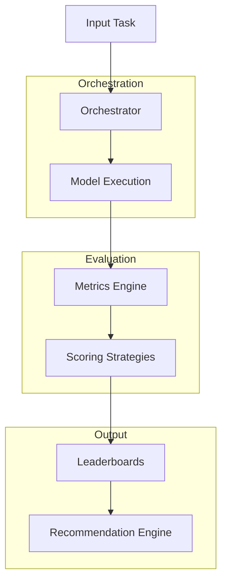

# Architecture Overview

## 🏗️ System Design

The platform is built as a modular pipeline for LLM evaluation and comparison.

## 🧩 Core Components
**Orchestrator**

Handles:

- model selection
- request routing
- execution coordination
- Evaluation Layer

Computes:

- lexical similarity metrics
- semantic similarity metrics
- hallucination estimates
- contextual faithfulness
- Scoring System

Applies configurable strategies:

- balanced scoring
- quality-first ranking
- cost-aware ranking
- latency-aware ranking
- Recommendation Engine

Produces:

- best model selection
- ranked alternatives
- confidence estimates
- validity checks

## 📊 Data Flow
- Input task received
- Multiple models executed
- Outputs evaluated via metrics
- Scores aggregated via strategy
- Ranking + recommendation generated

## ⚖️ Design Principles
- modularity over monoliths
- explicit trade-offs over hidden logic
- reproducibility over ad-hoc evaluation
- extensibility over fixed pipelines
